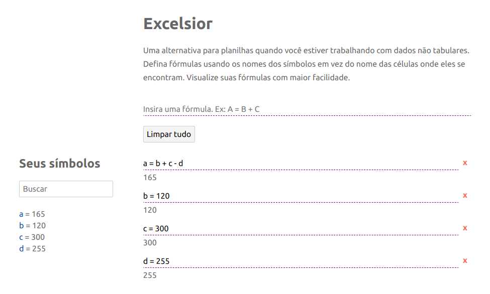

# Excelsior

> Your formula notebook.

[Excelsior](https://excelsiorapp.site) is meant to be an improvement on the experience we have on spreadsheets when working on non-tabular data.
Defining formulas with cell coordinates is wearing and prone to errors.
The visual feedback we get when using a cell in a formula helps but is far from how we actually reason about the formulas we are defining.

Another big goal with Excelsior is to empower users which want to perform math-driven decisions but:

1. are not skilled in applications commonly used to experiment with their hypothesis or
2. considered the apparent learning curve for those applications and are not willing to invest time into them.

## Preview



## Current status

This is on alpha but it is definitely usable, although the current user experience has plenty of room for improvements.

## Feature ideas

- Internationalization and localization
- Charts
- Change history with undo and redo
- Autocomplete in formulas. While typing a formula, a dropdown would appear below the careat exhibiting known literals matching what has been typed with fuzzy search and what not.
- Renaming literals
- Managing multiple workspaces
- Sharing workspaces
- Draw formulas instead of rendering them as text allowing interactions such as hovering in a literal and highlighting all of their occurrences in the workspace.
- Restriction definition. For instance, define that my monthly expenses must be smaller than 90% of my salary. This can serve as validation or guides to maximize/minimize variables (linear programming).
- Excel export
- Literals which vary over time. This feature

## Development

The stack is defined by Svelte 3 on Typescript, Webpack and Yarn. MathJS is the only application dependency for now.

Install application and development dependencies.

```bash
yarn install
```

Run the build script a first time to avoid 404 errors about missing `bundle.css` in the browser:

```bash
yarn build
```

Start the server:

```bash
yarn dev
```

Navigate to http://localhost:8080. You should see the app running.

## Build

```bash
yarn build
```

The compiled files will be created at the `public` folder.

## About the template

This is a copy of official [Svelte template for Webpack](https://github.com/sveltejs/template-webpack) with added HMR support.

This HMR implementation relies on Svelte's private & non documented API. This means that it can stop working with any new version of Svelte.

Progress of Svelte HMR support can be tracked in [this issue](https://github.com/sveltejs/svelte/issues/3632).

**NOTE** The template pins the major version of Svelte, using the [tilde comparator](https://docs.npmjs.com/misc/semver#tilde-ranges-123-12-1) because, in practice, HMR breakages tend to only happen with new major versions of Svelte. In your app, you can change this to your liking -- because you might be more interested in last version of Svelte than working HMR, or be wise and pin the exact versions of all you dependencies.
